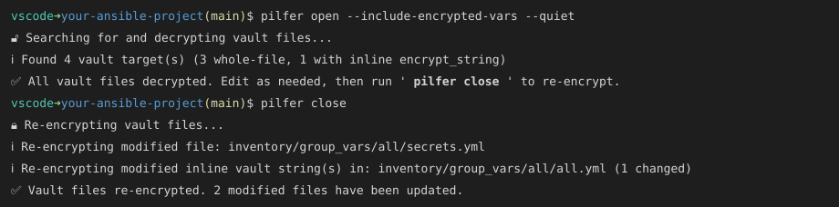

[](https://github.com/aioue/pilfer/actions/workflows/ci.yml)
[](https://github.com/aioue/pilfer/actions/workflows/test.yml)
[](https://github.com/aioue/pilfer/actions/workflows/github-code-scanning/codeql)
[](https://github.com/aioue/pilfer/network/updates)
[](https://www.python.org/downloads/)
[](https://www.gnu.org/licenses/gpl-3.0)

# pilfer

**Decrypt *all* ansible vault files in a project in-place recursively for viewing/editing, then re-encrypt them all at once when you're done.**

Walkthrough: [Bulk edit Ansible vault files with pilfer](https://aioue.net/2026/08/07/pilfer-bulk-ansible-vault-edit/)

Optionally decrypt/re-encrypt all [encrypted variables](https://docs.ansible.com/projects/ansible/latest/vault_guide/vault_encrypting_content.html) in-place, or re-key an entire tree after a password exposure.

## Output

Example session:



<details>
<summary>Plain-text transcript</summary>

```text
$ pilfer open --include-encrypted-vars --quiet
🔓 Searching for and decrypting vault files...
ℹ️  Found 4 vault target(s) (3 whole-file, 1 with inline encrypt_string)
✅ All vault files decrypted. Edit as needed, then run 'pilfer close' to re-encrypt.
$ pilfer close
🔒 Re-encrypting vault files...
ℹ️  Re-encrypting modified file: inventory/group_vars/all/secrets.yml
ℹ️  Re-encrypting modified inline vault string(s) in: inventory/group_vars/all/all.yml (1 changed)
✅ Vault files re-encrypted. 2 modified files have been updated.
```

</details>

## Quick start

Requires **Python 3.10+** and **Ansible** on `PATH`.

```bash
pipx install pilfer
cd your-ansible-project
pilfer open
# edit or search plaintext
pilfer close
```

Unchanged files are restored to their original ciphertext automatically.

Add to `ansible.cfg` so you do not need `-p` on every run:

```ini
[defaults]
vault_password_file = ~/.ansible-vault/.vault-file
```

## Features

- **ansible.cfg integration** - Automatically reads `vault_password_file` from your ansible.cfg
- **Change detection** - Only re-encrypts files that were actually modified (using SHA256)
- **Safe operation** - Preserves original encrypted content for unchanged files
- **No third-party dependencies** - Uses Ansible's official vault implementation directly
- **Binary data preservation** - Preserves exact line endings and formatting (critical for certificates)
- **Inline `encrypt_string` support** - Opt-in via `pilfer open --include-encrypted-vars`; decrypts YAML `!vault` scalars in place (with `# pilfer:vault:N` markers); `close` always re-encrypts whatever the session opened
- **Fail-closed sessions** - Refuses double-`open`, keeps session state if `close` partially fails, non-zero exit codes on errors

## Usage

```
pilfer [--version] COMMAND ...

Commands: open | close | rekey

pilfer open [--include-encrypted-vars] [-q] [-p VAULT_PASSWORD_FILE]
pilfer close [--allow-removals] [-p VAULT_PASSWORD_FILE]
pilfer rekey --old-vault-password-file OLD --new-vault-password-file NEW [options]
```

Run `pilfer --help` or `pilfer COMMAND --help` for full options and examples.

Re-key an entire tree (inline `!vault` included by default): `pilfer rekey --old-vault-password-file OLD --new-vault-password-file NEW --dry-run`.

### Inline encrypted variables (`encrypt_string` / `!vault`)

Whole-file vaults are opened by default. Inline `!vault` scalars are **opt-in**:

```bash
# Open whole-file vaults AND inline encrypt_string values
pilfer open --include-encrypted-vars

# Edit values in place. pilfer rewrites each !vault block like:
#   db_password: "the-secret"  # pilfer:vault:0
#
# Do NOT remove the `# pilfer:vault:N` comment - close uses it to find
# and re-encrypt each value. Do NOT commit while those markers are present
# (plaintext secrets + session metadata would land in git).

pilfer close   # no flag needed; re-encrypts everything this session opened
```

`close` always re-encrypts session entries (whole-file and inline). The
`--include-encrypted-vars` flag is only meaningful on `open`.

If you delete an entire opened variable line (key + value + marker), `close`
refuses by default (ambiguous delete vs accident). Confirm with:

```bash
pilfer close --allow-removals
```

which then prints:

```text
🔍 Detected removal of 1 encrypted vars:
  - db_password
```

Do not strip only the `# pilfer:vault:N` comment while leaving the key - close
will refuse so plaintext is not stranded. Renaming the key and dropping the
marker is also refused if the secret value is still present in the file
(including in comments).

### Vault password file

Pilfer finds the vault password in this order: `-p`, then `vault_password_file` in `ansible.cfg`, then common paths (`~/.ansible-vault/.vault-file`, `.vault_password`, and others).

### Examples

```bash
pilfer open
pilfer open -p ~/.my-vault-password
pilfer open --include-encrypted-vars
pilfer close
```

## Rotating the vault password

`pilfer close` is **not** password rotation - it refuses a different password than
the one used for `open` (anti re-key). To rotate every vault target in the tree
(including inline `!vault` spans):

```bash
# Plan / decrypt-check only
pilfer rekey \
  --old-vault-password-file ~/.ansible-vault/.vault-file \
  --new-vault-password-file /tmp/new-vault-pass \
  --dry-run

# Re-key ciphertext (prompts: type REKEY). Inline spans included by default.
pilfer rekey \
  --old-vault-password-file ~/.ansible-vault/.vault-file \
  --new-vault-password-file /tmp/new-vault-pass

# After 100% success, optionally archive the old password file and install the new
# one at the old path (chmod 600):
pilfer rekey ... --rotate-password-file
```

Refuse to rekey while a pilfer session is open. Nested git checkouts are skipped
(run `pilfer rekey` from those directories separately). Prefer `--dry-run` first.
A mid-run failure can leave a split-password tree; **re-run the same `rekey`
command to resume** (files already on the new password are skipped).
`--rotate-password-file` is refused with `--no-include-encrypted-vars`, and also
when nested git checkouts were skipped, so the live password file is not rotated
while ciphertext remains on the old password. Stale `.pilfer-rekey-*` staging
files are ignored as vault targets and removed only after confirmed mutating
rekey (never on `--dry-run`).

## Safety

Pilfer **fails closed**: if it cannot prove a secret is safely re-encrypted or
intentionally removed, it keeps the session and `.vault/` backups and exits
non-zero. It does not invent fixes for ambiguous edits.

### Failure modes this protects against

- Silent re-key on `close` with a different password than `open`
- Double-`open` destroying encrypted backups under `.vault/`
- Orphan plaintext after deleting `vaultedFileList.json` (markers, `.vault/`, or `*.pilfer-open` sidecars still block re-open)
- Stranded plaintext after stripping markers, renaming keys, or relocating secrets (including into comments)
- Crash mid-decrypt leaving unmarked plaintext (open sidecars are written before plaintext)

### Surprising-by-design behaviors

- **Interrupted close retries:** whole-file targets only count as already done when
  working bytes match the open backup, or the file is vault ciphertext decryptable
  with the session password (not an arbitrary foreign vault blob).
- **`close` is progressive** - files that succeed are encrypted and dropped from the session; failures stay plaintext until you fix and retry. Not an all-or-nothing transaction.
- **Intentional var removal** requires `pilfer close --allow-removals`.
- **Short secrets** can block close if the same bytes appear elsewhere in the file (docs/comments) - fail closed.
- **Nested git checkouts** are skipped; run pilfer from those roots if needed.
- **Legacy unbound sessions** can `close` only if the password decrypts the session backups (then pilfer binds a v2 fingerprint); otherwise remove the session list and re-`open`.
- **Incomplete open** (session list written, crash before decrypt) is cleared on the next `open` only when listed paths still look like vault ciphertext and there are no backups/sidecars - so you are not told to `close` ciphertext. If the session list remains but files are already plaintext (artifacts deleted), `open` still refuses.
- **`*.pilfer-open` sidecars** sit beside opened files (whole-file opens have no `# pilfer:vault:` markers).

### Gitignore

```gitignore
vaultedFileList.json
.vault/
**/*.pilfer-open
```

### Pre-commit hook (suggested)

Block commits while a session is open:

```bash
# .git/hooks/pre-commit (chmod +x)
if [ -e vaultedFileList.json ] || [ -d .vault ] \
  || find . -name '*.pilfer-open' -print -quit 2>/dev/null | grep -q .; then
  echo "pilfer session open (vaultedFileList.json / .vault / *.pilfer-open); run pilfer close first"
  exit 1
fi
# Optional: also refuse # pilfer:vault: markers from --include-encrypted-vars
if git grep -n '# pilfer:vault:' -- '*.yml' '*.yaml' >/dev/null 2>&1; then
  echo "files still contain # pilfer:vault: markers; run pilfer close first"
  exit 1
fi
```

### Recovery

- Session present (`vaultedFileList.json`) → fix the reported issue → `pilfer close` again.
- Session deleted but markers / `.vault` / `*.pilfer-open` remain → restore `vaultedFileList.json` from backup if you have it and `close`, or manually re-encrypt / restore secrets before `open`.

## License

GPLv3+. See [`PILFER_LICENSE.txt`](PILFER_LICENSE.txt).

## Credits

Borrows heavily from the excellent, but no longer supported [Ansible Toolkit](https://github.com/dellis23/ansible-toolkit).

Maintainers: development setup, releases, and CI details in [`.github/workflows/README.md`](.github/workflows/README.md).
